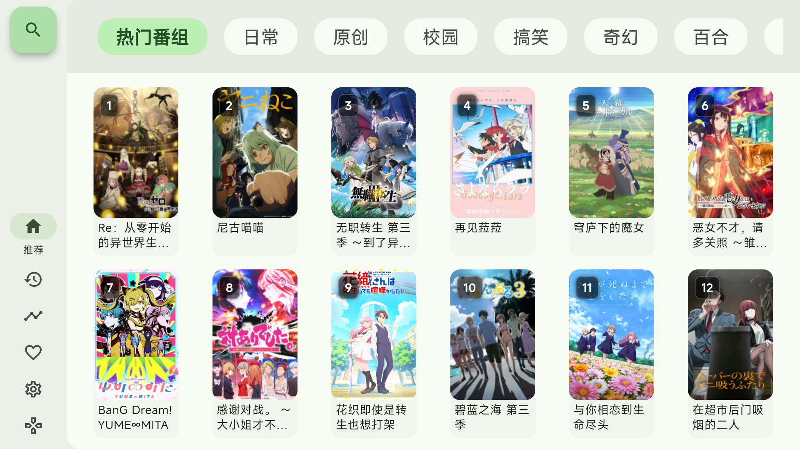
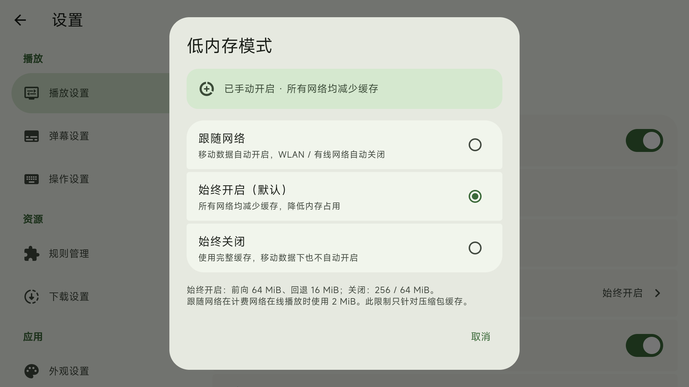

<div align="center">
  
  <h1>Kazumi TV</h1>
  <p>保留 Kazumi 原有风格，适配 Android TV / Google TV 的遥控器与大屏。</p>
</div>

基于 [Predidit/Kazumi](https://github.com/Predidit/Kazumi) 的非官方 TV fork，源码沿用 GPL-3.0。

**当前版本：Preview 5（2026-09-13），公开测试版，不是稳定版。**
本版来自 A 线 `codex/tv-phase1-hardening`；未包含 B 线后续改动，不提供手机到电视接力承诺。

[下载 Preview 5](https://github.com/znbsf/Kazumi/releases/tag/v2.3.1-tv-preview.5) ·
[反馈问题](https://github.com/znbsf/Kazumi/issues) ·
[更新说明](docs/TV_PREVIEW_5.md) · [详细验证记录](docs/TV_PHASE1_DELIVERY.md)

## 项目介绍

Kazumi TV 面向使用遥控器的 Android 电视、电视盒子和 Google TV。它沿用 Kazumi 的番剧资料、
规则解析和播放器基础，在共享业务代码上补充大屏布局、方向键导航和电视默认设置。
首页浏览、搜索、历史续播、追番与选集可以围绕遥控器使用；主题颜色、圆角和卡片保持原有风格。

番剧资料与评论来自 Bangumi，视频内容由所配置的来源规则解析。资料能加载，不代表每个视频来源都可播放；
来源可用性、验证码和网络环境会影响结果。本仓库提供播放器与适配代码，不提供自有视频资源库。

### 功能一览

| 模块 | 当前能力 |
| --- | --- |
| 电视入口 | 独立包名、电视桌面入口、横屏与 TV 图标，可与手机版共存 |
| 分类浏览 | 分类焦点自动显露、海报两排布局、标题两行、当前分类数字编号直达 |
| 搜索 | 关键字搜索与结果浏览，遥控器确认后进入输入；需要系统输入法 |
| 历史与追番 | 浏览历史、继续观看、详情入口、追番及删除确认 |
| 详情 | 番剧资料、评分与主要操作；播放入口优先获取焦点 |
| 播放与选集 | media-kit / libmpv 播放器，选集、播放线路选择、播放控制和诊断信息 |
| 设置 | 分类与内容双栏导航，低内存模式、播放、弹幕、网络和存储等设置 |
| 缓存 | 最近分类数据短时复用，减少左右切回时重复请求 |

下载、同步等继承自上游的入口仍在代码中；未逐项完成 TV 验收，不等同于本版新增或保证可用。

**快速导航：**[安装](#下载与安装) · [初次使用](#初次使用) · [截图](#界面截图) ·
[遥控操作](#遥控操作) · [常见问题](#常见问题) · [构建](#开发与构建) · [反馈](#反馈问题)

## 下载与安装

| 设备 | APK |
| --- | --- |
| 32 位 ARM 电视，包括本轮小米测试机 | [armeabi-v7a](https://github.com/znbsf/Kazumi/releases/download/v2.3.1-tv-preview.5/Kazumi-TV-2.3.1-tv-preview.5-armeabi-v7a.apk) |
| 64 位 ARM Android 系统 | [arm64-v8a](https://github.com/znbsf/Kazumi/releases/download/v2.3.1-tv-preview.5/Kazumi-TV-2.3.1-tv-preview.5-arm64-v8a.apk) |
| x86_64 模拟器 / 设备 | [x86_64](https://github.com/znbsf/Kazumi/releases/download/v2.3.1-tv-preview.5/Kazumi-TV-2.3.1-tv-preview.5-x86_64.apk) |

版本名 `2.3.1-tv-preview.5`，独立包名 `com.znbsf.kazumi.tv`，可与手机版共存。
以 Android 系统实际支持的 ABI 选包，不能只按芯片型号判断；三种包不需要都装。
同签名旧 TV 版可覆盖安装保留数据。发行页提供 `SHA256SUMS.txt`；源码压缩包不是 APK。

### 如何选包

| 架构 | 文件大小约 | versionCode |
| --- | --- | --- |
| armeabi-v7a | 26.8 MiB | 203121 |
| arm64-v8a | 27.8 MiB | 203122 |
| x86_64 | 28.8 MiB | 203124 |

可在设备信息工具中查看系统 ABI；使用 ADB 时执行 `adb shell getprop ro.product.cpu.abilist`。
部分电视采用 64 位芯片和 32 位系统，应安装 armeabi-v7a 包。

### 安装与升级

1. 从上方发行页下载匹配系统的 APK。
2. 通过 U 盘、电视文件管理器或 ADB 安装；按电视提示允许对应安装来源。
3. 在电视应用列表中打开 Kazumi TV，首次运行完成初始化设置。
4. 升级时覆盖安装；先保留旧应用数据，避免为解决签名冲突直接卸载。

```sh
# 已开启调试并获电视授权时，可通过 ADB 覆盖安装
adb connect <电视IP>:5555
adb install -r Kazumi-TV-2.3.1-tv-preview.5-armeabi-v7a.apk
```

若提示签名不一致，自行构建包与公开包可能使用不同密钥；若提示版本降级，检查实际 versionCode。
Preview 5 沿用先前 TV 测试签名。当前属于测试签名发行，不应将 release 构建模式理解为正式签名管理完成。

## 初次使用

1. 完成使用约定、更新来源、网络镜像与添加规则等初始化步骤。
2. 按自己的网络情况配置镜像及来源规则，返回首页浏览分类或搜索番剧。
3. 从详情进入播放，选择可用来源；在选集面板中切换线路和剧集。
4. 在设置里调整播放和显示选项。已有用户选择会保留，不会因升级统一重置。

升级安装通常不会重新显示初始化流程。本 fork 的安装包请以本仓库 Releases 为准。

## 界面截图

以下为本轮 A 线小米 Android 9 真机截图。首页与设置图来自 Preview 5 发布前的候选包，
展示已包含在 Preview 5 中的布局，不是设计稿。

### 首页两排海报与两行标题



### 低内存模式保留三项选择



## 本次更新

- 分类栏增加独立底色，左右移动焦点时自动滚动，完整显示选中的分类；节目编号角标改为半透明。
- TV 首页按可用高度展示两排完整海报与标题；标题最多两行，超长省略。移除遮挡标题的首页悬浮按钮。
- 分类内容使用内存缓存：有效期 10 分钟、最多 8 类、每类最多 240 条。切回已浏览分类可复用结果。
  顶部分类名称本来就是本地常量。此缓存不跨应用重启，也未新增图片磁盘队列。
- 低内存设置统一保留“跟随网络 / 始终开启 / 始终关闭”。仅 TV 初始默认“始终开启”，已有选择优先。
- 设置内容区可用左键回分类栏，右键进入内容，修复部分设置之间无法导航的问题。
- 播放线路菜单打开后自动聚焦当前线路；上下移动、确认选择、关闭恢复焦点，并明确显示焦点边框。
- 测试包未配置评论镜像凭据时直接提示原因，不发送注定失败的评论请求，也不自动切换网络路径。
- 吸收上游至 `2624e0c0` 的 UI 基础，包括设置卡片和初始化流程，并保留 A 线焦点与播放进度修复。

## 评论、弹幕与验证边界

评论镜像需要构建时注入 `KAZUMI_APPID` 和 `KAZUMI_KEY`，它们是接口凭据，不是 APK 签名证书。
本次 APK 未包含这些凭据，分集评论显示“测试包未配置评论镜像凭据”。播放和选集不受影响。
手动关闭 Bangumi 镜像后仍可尝试官方接口，但本轮电视直连超时，不能承诺评论可用。
本版也不包含在线弹幕私有凭据，不把示例弹幕当成真实在线结果。

- 发布前全量 Flutter 测试 331 项通过。分类、设置及两排布局已有小米 Android 9 真机短程验证。
- 播放线路菜单真机确认能向下聚焦线路 2；上下、确认和焦点恢复另有组件测试。
- 自动测试和 ADB 键码不等于实体遥控器全部按键、全部设备均已验收。
- 没有全机型、全部来源、4K/HDR、长期音画同步或内存稳定性验收结论。
- 部分来源验证码兼容性、次级页面焦点和播放器恢复边界仍需继续验证。

## 遥控操作

方向键移动焦点，OK 确认；返回退出当前层级。首页数字键按当前分类节目编号定位，编号不是永久频道号。
设置页左右切换分类与内容区域；播放线路菜单上下选择，OK 生效。
保留原有颜色和卡片风格，本次不重做整套 TV 交互。

| 按键 / 场景 | 操作 |
| --- | --- |
| 首页左右 | 移动分类或海报焦点；分类栏随焦点滚动 |
| 首页数字键 | 输入当前分类节目号；OK 提前确认数字输入 |
| 首页首列左键 | 回到侧栏；从侧栏返回内容时恢复焦点 |
| 设置左右 | 在分类栏与内容区之间切换；具体控件可优先处理方向键 |
| 线路菜单上下 / OK | 移动线路焦点 / 确认线路；打开时聚焦当前线路 |
| 播放控制隐藏时 OK / 下 | 唤醒控制栏并聚焦播放操作；再次确认执行按钮 |
| 播放控制隐藏时上 | 唤醒选集入口 |
| Play / Pause / PlayPause | 播放 / 暂停；详情页可用于续播 |
| INFO | 显示播放诊断信息；不同遥控器可能没有此键 |
| Back / Escape | 关闭当前层或返回；优先使用可见入口完成操作 |
| 系统 Home / 音量 | 仍由系统处理 |

厂商可能拦截部分硬件键。应用内遥控器帮助和可见按钮提供替代入口，不能保证每种遥控器的特殊键都送达应用。

## 常见问题

### 为什么重新启动后分类还要加载？

本次新增的是控制器内存缓存，退出进程后不保留。它保存最近分类的节目资料，不是离线视频缓存。
10 分钟过期、超过 8 类被淘汰或数据未成功取得时，仍需要请求。图片缓存未在本轮改成独立持久队列。

### 低内存模式会降低清晰度吗？

它主要调整播放器的压缩数据缓存预算，不是降低分辨率，也不是整个应用的内存上限。
TV 初始默认始终开启；可以保留自己的三态选择。网络抖动、编码格式和设备性能仍可能造成卡顿。

### 评论提示缺少凭据，要重新安装吗？

不用。这是本次测试包的已知限制；缺少的是评论镜像接口的 App ID 和密钥，重新安装同一个包不会补齐。
此状态不发送评论请求，也不自动切换到官方接口。它与 APK 安装证书、视频来源解析是不同问题。

### 有封面，但视频解析失败怎么办？

封面资料与视频来源使用不同请求。先尝试其他线路或来源，再检查网络与规则是否可用。
若某个来源要求验证码，应记录具体页面与错误；不能仅凭解析超时判断是播放器解码问题。

### 打开硬件加速就一定是硬解吗？

实际解码取决于设备和媒体编码，请查看播放诊断中的实际解码与输出路径。
开关状态本身不能证明当前视频使用了硬解；模拟器出画也不能代表电视芯片表现。

### 能用手机遥控或接力到电视吗？

本版不提供已完成的手机到电视接力功能。当前发布范围是 A 线独立 TV 应用，其他分支的实验不等同于发行能力。

## 开发与构建

使用与仓库兼容的 Flutter / Android SDK。TV 与 mobile 为独立 flavor。

```sh
flutter pub get
flutter test
flutter analyze
flutter build apk --flavor tv --release --target-platform android-arm,android-arm64,android-x64 --split-per-abi --build-number 20312 --build-name 2.3.1-tv-preview.5
```

发行 APK 使用项目配置的签名；重新构建须使用自己的安全签名配置。不要提交密钥或私有接口凭据。
普通贡献 PR 与本 fork 的完整 TV 开发分支分开整理；本次未向上游提交 PR。

### 开发环境与输出

[pubspec.yaml](pubspec.yaml) 声明 Flutter 3.47.2。可用 Android Studio 的 Flutter / Dart 插件打开仓库根目录，
配置 JDK 和 Android SDK，通过 Device Manager 创建 Android TV / Google TV 模拟器。

```sh
# 运行 TV 调试入口
flutter run --flavor tv -d <设备ID>

# 需要检查手机布局时单独构建
flutter build apk --debug --flavor mobile
```

APK 输出在 `build/app/outputs/flutter-apk/`；发布时再按版本与 ABI 命名。
自行构建通常使用本机签名，未必能覆盖公开测试包。后续更新应同时检查 build number、ABI 对应的 versionCode 和签名。
模拟器用于布局和键盘 / 遥控导航回归；播放性能、实际解码及长期运行仍需真机检查。

### 分支与发布

默认分支为 `codex/tv-phase1-hardening`，用于完整 A 线开发和项目首页展示。
`v2.3.1-tv-preview.5` 标签固定本次发行源码；默认分支可能包含之后的文档或代码更新。
下载 APK 时以 Release 说明为准，不应将默认分支的后续提交视为已安装版本的功能。

## 反馈问题

请在 [Issues](https://github.com/znbsf/Kazumi/issues) 中尽量提供：

- 电视 / 盒子型号、Android 版本、安装包版本与架构。
- 进入问题页面的步骤，按了哪些方向键或确认键，期望发生什么。
- 截图或短视频；焦点问题请保留焦点边框所在位置。
- 播放问题提供来源、线路、集数、报错及诊断信息；不要附带令牌、账号凭据或签名密钥。

区分“界面无法操作”“请求加载失败”和“已出画但播放卡顿”有助于定位。
路线图和历史问题记录用于追踪，不代表所有列出的改进都已纳入当前 APK。

## 历史记录

[Preview 4](docs/TV_PREVIEW_4.md) · [A 线交付记录](docs/TV_PHASE1_DELIVERY.md) ·
[首页滚动回归](docs/TV_HOME_SCROLL_REGRESSION.md) · [路线图](docs/TV_ROADMAP.md)

历史文档中的冻结 SHA、旧测试数量、旧包与待办属于当时快照，以本版说明为准。

## 上游、许可证与资源署名

感谢 [Predidit/Kazumi](https://github.com/Predidit/Kazumi) 及其
[贡献者](https://github.com/Predidit/Kazumi/graphs/contributors) 提供项目基础。
本 fork 继续遵守 [GPL-3.0](LICENSE)，对应发行源码保留在各 Release 标签中；
上游官网、社区、奖项、赞助和 Windows 签名服务不代表本 fork 获得相同支持。

TV APK 使用本 fork 原创几何电视标识（GPL-3.0），不打包上游人物图标。
源码保留的上游图标来自 [Yuquanaaa](https://www.pixiv.net/users/66219277) 的
[Pixiv 作品](https://www.pixiv.net/artworks/116666979)，版权属于原作者，不能据上游的使用许可推定
本 fork 或其他分发者也获得授权。字体 Mi Sans 由 Xiaomi 开发并拥有相关权利，沿用其资源许可。

感谢继承使用的开源项目与服务，包括 media-kit / libmpv、XpathSelector、Hive、avbuild、
Bangumi、弹弹 Play、Anime4K、Syncplay 与 trace.moe。依赖或代码的存在不代表相关功能
已经在 TV 预览版完成验收。软件许可不授予第三方视频、评论、图片或台标的内容使用权；
请遵守相应服务条款和资源许可，软件按 [LICENSE](LICENSE) 所述提供。
