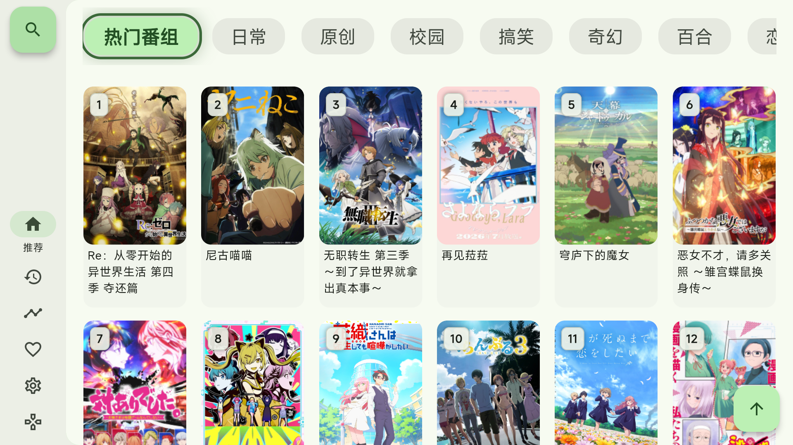
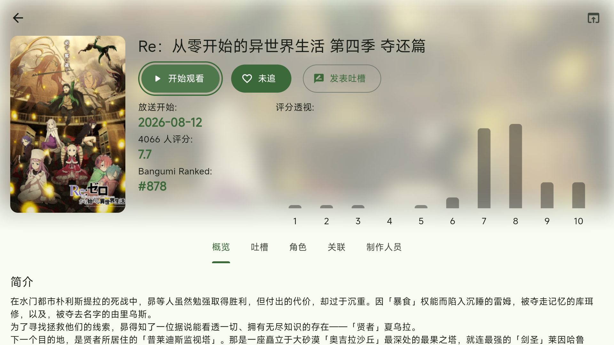
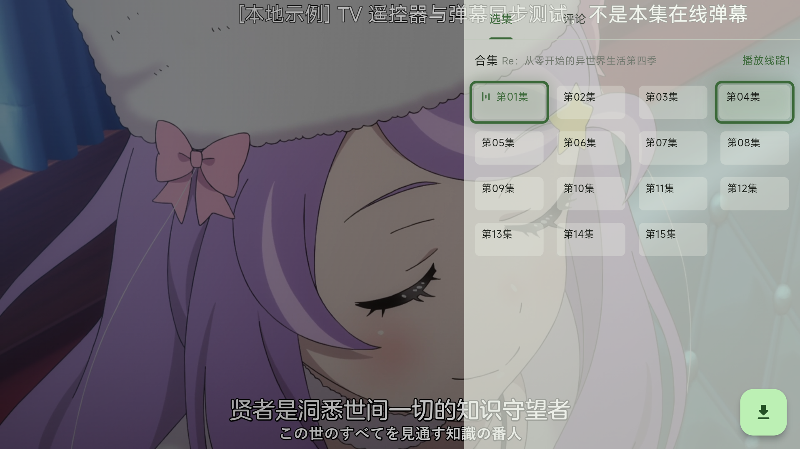
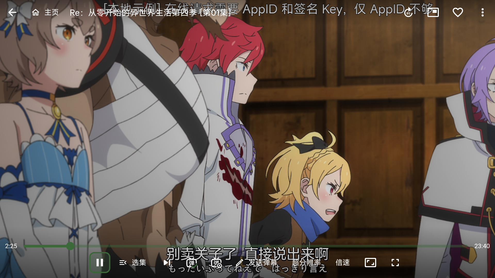

<div align="center">
  
  <h1>Kazumi TV</h1>
  <p>保留 Kazumi 原有风格，为 Android TV / Google TV 适配遥控器与大屏界面。</p>
</div>

这是基于 [Predidit/Kazumi](https://github.com/Predidit/Kazumi) 的**非官方开源 TV fork**，
不是上游官方电视版。源码沿用 GPL-3.0；本仓库当前发布和测试的重点是独立 TV APK。

**当前为 Preview 2 公开测试阶段，不是稳定版。** 手机与电视的接力播放尚未实现。
以下状态更新于 **2026-09-06**；“已发布”“已知问题”和“后续计划”分别列出，
后续计划不代表下载的 APK 已包含相应修复。

[下载 Preview 2](https://github.com/znbsf/Kazumi/releases/tag/v2.3.0-tv-preview.2) ·
[反馈问题](https://github.com/znbsf/Kazumi/issues) ·
[UI 改进计划](#ui-plan) ·
[阶段路线图](docs/TV_ROADMAP.md)

## 下载与安装

请到**本 fork 的发行页**下载，不要将上游手机版、其他平台安装包或 GitHub 自动生成的源码压缩包当作 TV APK。

| 项目 | Preview 2 |
| --- | --- |
| 发行标签 | [`v2.3.0-tv-preview.2`](https://github.com/znbsf/Kazumi/releases/tag/v2.3.0-tv-preview.2)（Pre-release） |
| APK | [Kazumi-TV-2.3.0-tv-preview.2-universal.apk](https://github.com/znbsf/Kazumi/releases/download/v2.3.0-tv-preview.2/Kazumi-TV-2.3.0-tv-preview.2-universal.apk)，约 66.9 MiB |
| 应用版本 | `2.3.0` / versionCode `203010` |
| 独立包名 | `com.znbsf.kazumi.tv`，可与原手机版共存 |
| 架构 | `armeabi-v7a`、`arm64-v8a`、`x86_64` |
| 系统要求 | Manifest 最低 Android 7.0 / API 24；不代表所有 Android 7+ 设备已通过测试 |
| 弹幕 | 此预览包包含明确标注的**本地合成示例**，不是当前剧集的在线评论 |
| 签名与升级 | 当前为测试签名；Preview 1 可覆盖升级。已安装 203010 本地测试包，无需重复安装 |

APK SHA-256：

```text
262595628b7a75a2a0d92a26b1a75f4b27fda098fd81f24d3ae167cd439dcc68
```

安装 APK 后，从电视应用列表打开 **Kazumi TV**，按提示完成初始化与规则安装，
再选择节目和来源。来源失效或验证码问题不等于 APK 安装失败，见下方已知问题。

本 fork 的“检查更新”指向自己的 Releases；目前没有预览版后台自动下载安装。
发行页的 `SHA256SUMS.txt` 用于校验，`tv_preview.json` 是示例弹幕附件，不需要另行安装。
完整安装、升级与版本说明见 [Preview 2 说明](docs/TV_PREVIEW_2.md)。

## 已发布的 TV 适配

保留原有配色、圆角、海报卡片、评分信息及 libmpv / media-kit 播放内核，
不将电视版改成另一套视觉风格。

| 范围 | 当前实现与边界 |
| --- | --- |
| 独立电视应用 | `tv` / `mobile` 分别构建；TV 使用独立包名、Leanback 入口、横屏与 TV banner，不要求触摸屏 |
| 首页 | 横向分类，焦点突出并联动下方内容；节目按从左到右、从上到下编号；首列返回侧栏仍有已知问题 |
| 数字直达 | 1–999 节目号、匹配高亮、自动滚动、多位输入等待与有界查找；编号属于当前分类，不是永久频道号 |
| 侧栏与设置 | 常驻历史入口；遥控器快捷入口通往 TV 操作设置，固定键表与通用按键设置集中展示 |
| 详情页 | 播放、追番、吐槽移到标题下、海报右侧；默认聚焦播放；Play / PlayPause 优先续播历史，没有可用历史才选源 |
| 播放界面 | 半透明四列选集，播放键旁提供选集入口；集中底栏、部分区域首尾循环、逐层返回与可见主页入口 |
| 焦点与输入 | OK 唤醒控制栏并固定入口；经过发送弹幕按钮不弹键盘，明确确认输入后才打开键盘；并非所有子页面已完成遥控验收 |
| 播放诊断 | INFO 展示实际解码 / 输出路径、编码、帧率、缓存及丢帧，而非只展示“已开启硬解”设置 |
| TV 默认值 | 低内存模式、较小缓存预算、较长控制栏等待、减少触摸手势及动画；已有用户设置优先，不在升级时强制覆盖 |

Preview 2 相比 Preview 1，重点调整了详情页主操作位置、追番菜单返回、
选集透明与循环、播放器主页入口及详情媒体键续播。
[逐项更新与验证范围](docs/TV_PREVIEW_2.md)不包含下方尚待实施的 UI 改进。

### 实际验证到哪里

- **MiTV-ASTP0 / Android 9 / armv7：**203010 包验证了详情焦点、菜单返回、实际视频出画、
  媒体键续播、浅色透明选集、OK 唤醒、弹幕按钮不自动弹键盘、可见主页入口。
- **Google TV API 36 / x86_64 模拟器：**203010 包验证了详情操作、菜单返回、选源与续播；
  长返回等路径另有较早构建的验证记录。
- 发布前 216 项 Flutter 测试及修改文件静态分析通过。这是该版本的历史验证结果，
  不是本次文档更新重新执行了应用测试。
- 真机使用 ADB 注入键码，不等于实体遥控器全部硬件键和长按已通过。
  **没有全机型、全部来源、4K/HDR、长期音画同步 / 内存稳定性或在线弹幕端到端的验收结论。**

完整步骤与测试边界见 [焦点回归记录](docs/TV_FOCUS_REGRESSION.md)。
其他平台的代码仍继承自上游，但不代表本 fork 提供对应发行包或兼容性承诺；
本轮也未新增手机版 APK。

## 当前已知问题

以下针对**公开 Preview 2 / 203010 APK**。独立开发分支已处理 UI-01～UI-04，
完成组件与离线模拟器回归，但**尚未合并、发布或在实体电视复测**，见下方状态与[验证记录](docs/TV_FOCUS_REGRESSION.md#ui01-ui04-local)。

1. **首页首列左键返回侧栏不稳定：**真机可转到顶部分组并切换分类。
2. **选集状态和焦点难区分：**正在播放的集数与当前遥控焦点都使用相似粗绿色描边。
3. **部分来源验证码仍不兼容：**图片加载、输入 / 按钮定位、成功检测需要分别诊断；
   不把所有失败直接归因于同一种 WebView 问题。见 [验证码诊断计划](docs/TV_CAPTCHA_DIAGNOSTIC_PLAN.md)。
4. **实体遥控器长返回尚待验证：**可见主页按钮已有真机验证，但厂商可能提前拦截系统键。
5. **搜索与历史操作风险：**旧版实际组件对照已复现搜索 OK 不能进入编辑、历史编辑模式 OK 缺少删除确认；
   公开 APK 未更新，不能把开发分支的修复当成已发布功能。

<a id="ui-plan"></a>

## UI 审查与下一轮计划

UI-01～UI-04 已在 `codex/tv-focus-ui01-ui04` 实施并做离线回归，**尚未发布**；UI-05～UI-12 仍待实施。
P0 优先保障可操作性；P1 优化常用路径；P2 补齐边界。
保持原有风格，先统一焦点规则，不重新设计整套主题，也不借 UI 调整更换播放内核。

| 编号 / 优先级 | 证据状态 | 问题或改进方向 | 下一步与验收重点 |
| --- | --- | --- | --- |
| UI-01 / P0 | 开发分支已修；组件 + 离线 AVD | 首页首列左键不能稳定回侧栏 | 显式回侧栏、恢复原卡片与滚动；分类上下出口及详情返回已有组件测试；待真机复测 |
| UI-02 / P0 | 开发分支已修；深浅组件 + AVD 状态样例 | “正在播放 / 已选中”与“当前焦点”描边相似 | 焦点独占粗框，播放保留动态图标与文字，分类选中使用填充；未做本轮真实视频面板验收 |
| UI-03 / P0 | 旧组件已复现；开发分支组件 + AVD 通过 | 搜索输入区域被禁止后代聚焦 | TV 独立输入入口，OK 开键盘，原生返回先收键盘再关输入层；保留图片搜索与最近搜索记录；在线搜索另验 |
| UI-04 / P0 | 旧组件已复现；开发分支组件 + 离线 AVD | 历史内部操作不可达风险；编辑模式 OK 仅提示 | 独立“更多”、详情 / 追番 / 删除确认与焦点恢复；长列表末尾循环和空列表有组件测试；续播仅验证路由参数，非真实出画 |
| UI-05 / P1 | 体验改进建议 | 侧栏多数项目仅图标，含义不直观 | 聚焦时显示名称或适度展开；历史、时间表、遥控器帮助容易识别，内容不因展开反复跳位 |
| UI-06 / P1 | 体验改进建议 | 有历史时仍统一显示“开始观看” | 展示“继续观看 · 第 X 集”及已有来源 / 进度；无有效历史时保留选源，不猜测播放源 |
| UI-07 / P1 | 体验改进建议 | 播放底栏按钮多，寻找常用功能成本高 | 常驻播放、选集、弹幕、倍速和更多；低频功能归入可达菜单，保留原遥控快捷键与返回焦点 |
| UI-08 / P1 | 体验改进建议 | 选集面板仍有偏角落的下载悬浮入口 | 将下载入口整合到面板操作区；缩小遮挡，兼顾透明度、文字对比与焦点边框，不强制黑色主题 |
| UI-09 / P1 | 体验改进建议 | 选源长列表混合来源、结果与操作 | 尝试左侧来源、右侧结果的横向双栏；异步结果到达不抢焦点，进入与退出都可预测 |
| UI-10 / P1 | 代码风险及体验建议 | 部分获取失败仅记录日志，用户难区分加载阶段和失败 | 明示搜索、解析、验证、失败状态；提供可聚焦的重试 / 取消，不无限等待或无说明消失 |
| UI-11 / P2 | 体验改进建议 | 分类横向溢出与 LCN 所属范围不够明确 | 加边缘 / 位置提示；数字浮层说明当前分类；保留已有超时、页数上限与取消机制 |
| UI-12 / P2 | 待系统回归 | 设置及次级页面不能仅凭大屏布局认定完成 | 设置已有横向双栏，不再重复建设；逐项查左右栏、滑块、下拉框、输入框和返回恢复，并覆盖时间表、追番、下载等页面 |

实施顺序：

1. **操作可靠性：**UI-01～UI-04 已完成本地组件及离线模拟器回归；合并 / 发布前审查变更，实体电视复测需另外授权。
2. **常用路径：**优先侧栏文字与续播提示，再调整播放器 / 选集入口、选源双栏及错误反馈。
3. **边界收口：**空列表、加载失败、超长标题、大字体、720p / 1080p 布局、不满一行的网格及焦点恢复。

统一验收路径为：**进入 → 方向移动 → 确认 → 子菜单 → 返回 → 恢复原焦点**。
屏幕应只有一个明确的当前焦点；“在播 / 已选中”可以同时显示，但样式必须不同。
区域内循环要保留跨区域出口，不能为了循环形成焦点陷阱。
测试通过后才在后续 Release 的“本次修复”中登记，不预先勾选完成。

### 两个大阶段

- **第一阶段：独立 TV 版。**已发布 Preview 2，仍需完成上述导航、来源兼容和设备验收，不能等同于稳定版完成。
- **第二阶段：手机与 TV 联动。**手机选择投屏 / 接力后，让电视 App 使用对应节目、来源、集数和时间点继续播放；
  设备发现、配对、状态反馈与异常处理均待设计。上游已有的 DLNA / 同步相关代码不等于这套接力能力已经完成。
- **后续探索：日本实际播出台标角标。**需要可靠的节目与电视台映射，以及台标资源使用边界；当前只有节目编号，没有台标。

详细阶段台账与历史记录见 [TV 路线图](docs/TV_ROADMAP.md)。

## Preview 2 实际截图

以下为 **203010 实体电视截图**，不是设计稿；选集图保留了尚未修复的双描边问题。

<table>
  <tr>
    <td></td>
    <td></td>
  </tr>
  <tr>
    <td></td>
    <td></td>
  </tr>
</table>

## 遥控器速查

应用侧栏“遥控器”是操作设置的快捷入口；固定 TV 键表与可编辑通用按键集中在同一处。

| 按键 / 场景 | 动作 |
| --- | --- |
| 数字 0–9：首页 | 输入 1–3 位节目号；1.8 秒等待多位输入，OK 可立即确认 |
| Back：数字查找中 | 取消本次查找；切换其他主页栏目也会取消 |
| OK / 下键：控制栏隐藏 | 唤醒并聚焦播放 / 暂停；再次 OK 执行当前按钮，唤醒本身不暂停 |
| 上键：控制栏隐藏 | 唤醒并聚焦选集；控制栏显示时方向键用于移动焦点 |
| Play / Pause / PlayPause | 播放 / 暂停；详情页 Play / PlayPause 优先续播，无可用历史则选源 |
| Fast Forward / Rewind；Channel Up / Down | 快进 / 快退；下一集 / 上一集 |
| EPG / Guide / Top Menu / 黄键 | 打开选集 |
| CC / Captions / Audio Track / 红键 | 开关弹幕，不切换内嵌字幕轨 |
| Favorite / Bookmark / 绿键 | 标记为“在看”或取消追番 |
| INFO / 蓝键 | 视频信息与实际播放诊断 |
| HELP / MENU / F1 / Context Menu | 遥控器帮助 |
| Back / Escape | 关闭当前层或返回；长按 Back 约 1 秒后松开回应用首页，实体遥控长按待验证 |
| Stop / Exit / Media Close | 退出播放器 |
| Volume / Mute；系统 Home | 音量 / 静音交给系统；Home 仍回系统桌面，不被改成应用首页 |

数字查找在找到目标、数据源返回空页、额外加载 **5 页**、等待 **10 秒**或用户取消时停止。
只有明确到末尾才提示“没有该编号”；达到限制提示“暂未加载到”，不会无限查找。

厂商拦截的 EPG、音量等按键可能根本不会送达 App；提供替代入口不等于能够抢占系统键。
播放器的**可见主页按钮**可直接回 LCN 首页，无需依赖长按或特殊遥控器键。

## 播放与弹幕边界

### 电视默认值和硬件解码

TV 默认启用低内存模式，调整的是压缩数据缓存预算，并不等于整个进程的内存上限。
已有有效设置优先；升级不重置个人配置，详见 [TV 默认设置审查](docs/TV_DEFAULTS.md)。

TV 自动视频输出采用 `mediacodec_embed` 直连 Surface，保留用户显式选择的
`gpu` / `gpu-next`。启用硬件加速不保证所有编码都硬解，应通过 INFO 查看
`hwdec-current`、`current-vo` 等实际运行值。
直连路径不兼容 Anime4K 超分辨率及部分视频滤镜，不把“实时超分”作为本 TV 包的默认能力。
短程出画、模拟器通过与长期音画 / 4K / HDR 验收是不同结论。

### 本地示例不是在线弹幕

Preview 2 显式嵌入合成弹幕，每条标有 **[本地示例]**，用于暂停、seek、续播和同步测试。
本包没有配置在线弹幕 API 的 AppID 与签名 Key；**只有 AppID 不足以签名**，
这不代表弹弹 Play 服务故障，也不是当前剧集的真实评论。

可通过 CC / 红键关闭弹幕，或在“我的 → 弹幕设置 → 本地示例弹幕”关闭示例并重新进入播放。
关闭示例不会自动恢复在线弹幕。普通构建不会嵌入示例；示例不发送到服务器、不写入下载缓存。

在线构建需使用获授权的 `DANDANAPI_APPID` 与 `DANDANAPI_KEY`，不得把上游身份或密钥视为
fork 自动可用的凭证。仓库不提交密钥；配置凭证后仍需单独完成在线端到端验证。

## 开发与构建

项目使用 Flutter / Dart，可用 **Android Studio + Flutter / Dart 插件**打开仓库根目录。
通过 Device Manager 创建 Android TV / Google TV AVD；模拟器适合 UI 与遥控器回归，
不能代替真实电视芯片的解码性能和硬件键验证。

使用与 [pubspec.yaml](pubspec.yaml) 对齐的 Flutter SDK（当前声明 3.47.2），配置 Android SDK / JDK。
两个 flavor 共享业务代码，但分别生成 APK：`tv` 是电视版，`mobile` 保留手机版布局与原包名，
不是把两种安装入口塞进同一个发行 APK。

```powershell
flutter pub get

# TV 模拟器调试
flutter run --flavor tv -d <TV模拟器ID>

# 普通 TV Release，不嵌入本地示例
flutter build apk --release --flavor tv --build-number 203010

# 本地预览构建：显式嵌入合成示例
./scripts/build-tv-preview.ps1 -Flutter flutter -BuildNumber 203010

# 仅在需要回归手机版时构建
flutter build apk --debug --flavor mobile

# 自动测试与静态分析
flutter test
flutter analyze --no-fatal-infos --fatal-warnings
```

`203010` 对应当前预览版本；下一次发布应用改动时应递增 build number。
本地构建输出见 `build/app/outputs/flutter-apk/` 与 `build/app/outputs/apk/tv/`，
Gradle 命名包含 `Kazumi-TV`；发行页的 Preview 文件名由发布环节明确命名。

**自行构建不等于能覆盖安装公开 APK：**当前 Gradle 使用本机 debug keystore 作测试签名，
不同机器签名可能不同；发行测试签名私钥不在仓库中分发。
正式发行签名与后续升级策略仍需单独管理，不能把 `--release` 构建模式当作正式签名保证。

## 反馈、文档与发布约定

请在 [本 fork Issues](https://github.com/znbsf/Kazumi/issues) 提供：
电视型号、系统版本、APK versionCode、按键顺序、预期 / 实际结果；有截图更容易复现。
播放问题请区分来源加载、实际出画、音画同步与遥控操作。

不要公开账号、Cookie、验证码答案、API Key、鉴权链接或未脱敏原始日志。
App 会访问选定的来源及元数据等外部服务；不能把开源或本地历史存储理解为完全离线运行。

- [Preview 2 安装、更新和测试边界](docs/TV_PREVIEW_2.md)
- [阶段路线图与历史验收台账](docs/TV_ROADMAP.md)
- [焦点与设备回归记录](docs/TV_FOCUS_REGRESSION.md)
- [TV 默认设置](docs/TV_DEFAULTS.md)
- [验证码诊断待办](docs/TV_CAPTCHA_DIAGNOSTIC_PLAN.md)
- [开源播放器参考与设计取舍](docs/TV_OPEN_SOURCE_REFERENCES.md)
- [贡献指引](static/doc/CONTRIBUTING.md)

**README 记录当前状态与计划；Release 记录对应 APK 已包含的改动。**
发布后发现的问题可以带日期补充到发行说明，但不能改写成该版本已修复。
仅文档更新不重打 APK、不改标签、不冒充新版本；应用有变化时才构建、验证并发布下一版。
本 fork 的公开预览发行只提供 TV APK、校验文件、合成示例与对应源码，不沿用上游多平台下载宣传。

## 上游、许可证与资源署名

感谢 [Predidit/Kazumi](https://github.com/Predidit/Kazumi) 及其
[贡献者](https://github.com/Predidit/Kazumi/graphs/contributors) 提供项目基础。
本 fork 继续遵守 [GPL-3.0](LICENSE)，对应发行源码保留在各 Release 标签中；
上游官网、社区、奖项、赞助和 Windows 签名服务不代表本 fork 获得相同支持。

TV APK 使用本 fork 原创几何电视标识（GPL-3.0），不打包上游人物图标。
源码保留的上游图标来自 [Yuquanaaa](https://www.pixiv.net/users/66219277) 的
[Pixiv 作品](https://www.pixiv.net/artworks/116666979)，版权属于原作者，不能据上游的使用许可推定
本 fork 或其他分发者也获得授权。字体 Mi Sans 由 Xiaomi 开发并拥有相关权利，沿用其资源许可。

感谢继承使用的开源项目与服务，包括 media-kit / libmpv、XpathSelector、Hive、avbuild、
Bangumi、弹弹 Play、Anime4K、Syncplay 与 trace.moe。依赖或代码的存在不代表相关功能
已经在 TV 预览版完成验收。软件许可不授予第三方视频、评论、图片或台标的内容使用权；
请遵守相应服务条款和资源许可，软件按 [LICENSE](LICENSE) 所述提供。
