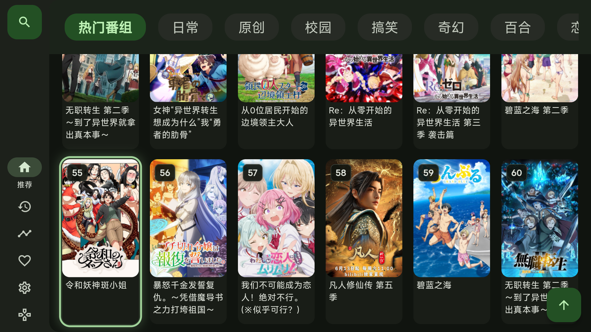
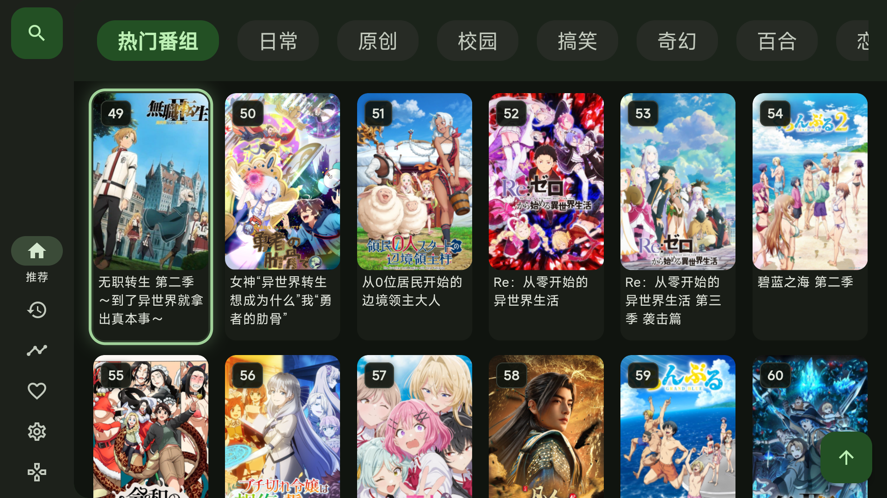
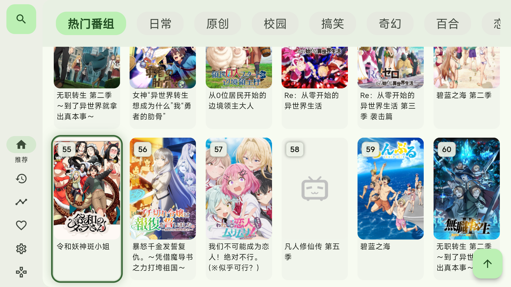
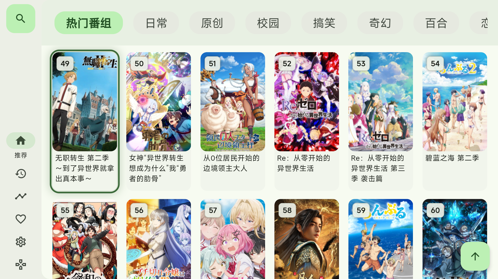

# 首页海报双向滚动回归（UI-14，2026-09-06）

本轮在 Preview 3 源码 `68e8101` 上修复首页 UI，保持配色、卡片尺寸、分类和导航入口不变。
首轮只修改本地源码和测试；随后已构建并在独立 Google TV AVD 验证离线样例包与正常入口包，详见下方。
前两轮未操作实体电视；用户随后要求真机测试，已将同一正常 203028 包装到 MiTV 并完成首页短程回归，详见末节。
诊断、实现与设备回归阶段均未调整镜像或代理，也未提交、推送或更新 Release；随后用户另行要求发布。
**UI-14 修复随 [Preview 4 / 203028](TV_PREVIEW_4.md) 发布；以下保留当时的分阶段记录，Preview 3 / 203026 不包含此修复。**

## 复现与原因

用户确认故障界面为首页海报列表，而非选源或播放器选集。诊断阶段使用真实 PopularPage / 壳层、
120 条离线数据，在 960×540、1280×720 逻辑尺寸下复现：DOWN 到 55 号后，UP 到 49 / 43 号时
滚动位置不回退，焦点进入不可见区域。该复现不访问 Bangumi；网络失败只能另行解释无法加载更多数据。

- 通用卡片使用 `keepVisibleAtEnd`，不向较小滚动位置回退。
- 首页只判断 `FocusNode.context` 是否存在，不能区分缓存节点、实际布局和可见范围。
- 原发布前 250 项测试没有覆盖长列表下滚后连续反向时的可见性，不能作为该路径已验收的证据。

## 本地修复

- 首页由页面统一管理卡片滚动：根据行高、行间距及固定分类栏计算目标可见范围，再转移焦点。
  向上与向下都只滚动必要距离；已经完整可见的行不因左右移动反复居中。
- 不再让首页卡片自身的通用自动滚动与页面控制同时执行。新增开关默认保持原行为，
  只在 TV 首页关闭，手机版及其他卡片调用不改变默认布局或滚动策略。
- 新输入取消旧动画 / 焦点请求；长按从待到达条目累计，快速反向或转入侧栏、详情、数字直达不会被旧请求抢回。
- 分类栏与首列侧栏出口保留；末行循环仅落到真实条目，避开顶部固定栏。
- 大跨度滚动导致旧卡片被回收时，允许同一焦点范围内的临时回退；真正转到其他控件或页面则不抢焦点。
- 侧栏返回、详情返回等非方向键恢复，同样按首页的可见范围显露海报。

补测曾发现两个中间失败：长按跨多行后旧卡片被回收导致焦点未转移，以及末行回首行时临时焦点触发旧滚动。
分别通过焦点范围检查和首页单一滚动控制处理；失败日志保留，不只保留最终通过记录。

## 自动回归与边界

最终新增首页专项 **14 项通过**；完整串行测试重跑 **264 项全部通过**，修改文件静态分析无问题，
`git diff --check` 通过。首次全量运行是 263 项通过 / 1 项失败：既有 AsyncRateLimiter
计时测试要求间隔至少 35 ms，本轮读到 34 ms；没有修改该模块，保留首轮失败日志，
不把重跑通过描述为消除了计时偶发风险。

新增 `test/tv_popular_scroll_test.dart`，使用真实首页、固定分类栏、虚拟网格及离线控制器：

- 854×480、960×540、1280×720 × 1.0 / 1.25 字号；下行九排再逐排返回，逐次核对节目号、唯一主焦点和完整可见范围。
- 已可见行的左右移动保持滚动位置；10 ms DOWN → UP、长按重复事件后 RIGHT。
- 滚动中返回侧栏、OK 进详情 / 原生返回、数字预览替代方向滚动。
- 不满行末尾回首行、分类出口，以及 120 条长列表末尾回首行。
- 分页测试控制器不增加数据，覆盖“已加载条目仍可导航”；不冒充真实网络超时或重试 UI 已修复。

以上自动测试使用 Flutter widget 测试运行时，不是 APK 或实体遥控器验收；后续 AVD 结果单独记录。
不将 Bangumi 的暂时恢复记作本 UI 修复的效果。

本地命令与日志：

```powershell
flutter test --no-pub --concurrency=1 test/tv_popular_scroll_test.dart
flutter test --no-pub --concurrency=1
dart analyze lib/pages/popular/popular_page.dart lib/bean/widget/tv_focusable_surface.dart lib/bean/card/bangumi_card.dart test/tv_popular_scroll_test.dart
```

原始复现、中间失败与修复后日志留在忽略目录 `artifacts/diagnosis-203026-bangumi/`。
此阶段尚未验证实体电视；后续安装与按键注入结果见末节，实体遥控器硬件节奏和全键覆盖仍不在验收范围。

## APK / Google TV 模拟器回归（同日追加）

使用独立 `Kazumi_Focus_UI_API36` / `emulator-5562`，Android 16 / API 36、x86_64，
1920×1080、density 320（Flutter 逻辑尺寸 960×540）。通过 ADB 发送 Android 原生方向键、
OK 与 BACK；读取截图和应用日志。没有借用实体电视，也没有更改模拟器代理。

### 离线长列表

本地专用 debug 包 `2.3.0-ui14-offline-test / 203027`，120 条样例，使用真实首页和壳层、
独立 Hive 目录；详情路由为测试占位页。样例入口只位于忽略目录 `artifacts/ui14-avd/`。

| 操作 | 实际结果 |
| --- | --- |
| 下行至 55，再上行至 49、继续至 1 | 焦点号符合预期，海报完整可见；49 上边界为逻辑 y=96，未被 88 高分类栏遮挡 |
| 下行至末行 115，再 DOWN | 循环到 1，列表和焦点一起回首行 |
| 首卡 LEFT / RIGHT | 到搜索侧栏入口，再恢复 1 号 |
| OK 进占位详情 / Android BACK | 恢复 1 号焦点和可见位置；不作为真实详情页验收 |
| 快速 DOWN → UP | 回到 1，没有旧请求覆盖新方向 |
| Android `input keyevent --longpress 20` | 从 1 到 13，焦点和整张海报可见；非实体遥控器持续长按测试 |

离线检查同时断言期望节目号和焦点矩形范围，关键截图已人工查看。
快速输入的 shell 命令之间设置 10 ms 等待，但包含 Android 命令开销，不能声称原生事件间隔精确为 10 ms。

### 正常入口与真实在线首页

完成离线场景后，以 `lib/main.dart` 重新构建 release 模式包并覆盖安装到同一 AVD，
不清空原有应用数据。包名 `com.znbsf.kazumi.tv`，版本 `2.3.0-ui14-test / 203028`，
包含 arm64-v8a / armeabi-v7a / x86_64。本地文件：
`artifacts/ui14-avd/Kazumi-TV-2.3.0-ui14-test-203028-universal.apk`（70,151,543 字节）。

SHA-256：`1c7ab1384019c72591171f83e50246d5d29e2749a84c2c2424e4064ba6964eb5`。
从 AVD 拉回已安装 `base.apk`，哈希与构建产物一致；版本与 ABI 已检查。
APK v2 签名验证通过，仍沿用项目 Android Debug 证书；release 是构建模式，不表示已发布或已采用正式发行密钥。
正常入口未引用离线 fixture，资产列表无本轮样例，实际运行恢复正常番剧和原有深色风格。

- 当次 `api.kazumi.fyi` 首页请求 offset 0 / 24 / 48 均返回 HTTP 200，约 252 / 273 / 261 ms。
  在线分页和海报实际加载，不把这一次连接成功当作之前网络问题已根治。
- 原生 DOWN 从 1 经多行到 55，UP 到 49，再逐排返回 1；反向时列表确实向上滚动，焦点框保持可见。
- 从首卡和深处 49 号进入真实详情页，再用 Android BACK 返回，均恢复原海报焦点；没有进入播放流程。
- 首卡及深处 49 号 LEFT 到侧栏再 RIGHT 返回，恢复原卡片；深处快速 DOWN → UP 仍回到 49。
- 快速下行时部分海报先显示占位图，随后加载；此次检查的是导航最终位置，未测图片加载性能或逐帧流畅度。
- 最终安装保留的是正常 203028 包，不是离线 203027 包。离线测试目录仍仅存在于 AVD 应用数据及本地忽略目录，
  正常入口不读取它，没有打入正常 APK。

以下是正常 203028 APK 的 AVD 实拍，不是 Flutter widget 渲染，也不是实体电视照片：

下滚到 55 号，焦点完整显示在下方：



按 UP 后，49 号完整回到固定分类栏下方：



本地 AVD 脚本、截图、焦点 JSON 与构建 / 应用日志在 `artifacts/ui14-avd/`。
本次没有重跑前述 264 项组件测试，也没有修改应用代码；新增的是 APK 与 AVD 证据。
**公开 Preview 3 / 203026 没有更新；实体电视、Android 9、实体遥控器长按和视频播放均未在本轮验收。**

## MiTV 实体电视安装与回归（同日后续）

用户要求转到自己的电视安装测试后，重新连接并核对 MiTV-ASTP0 / mulan，Android 9 / API 28，
armeabi-v7a、1920×1080、density 320。以下为真实电视上的操作，不再是 AVD 证据。

### 安装与数据保留

- 安装前版本为 203026，旧 `base.apk` 已备份到本地忽略目录 `artifacts/tv-ui14-203028/previous.apk`，
  SHA-256 为 `e26e329196a6e485683c5ce78118c5f9b3cb0e66f23b739ddaaa378d5202b690`。这只是 APK 备份，不是应用数据备份。
- 使用 `adb install -r` 覆盖到 **2.3.0-ui14-test / 203028**，安装结果 Success；未卸载、未清数据。
- 拉回安装后的 `base.apk`，SHA-256 与前述正常 203028 构建产物完全一致：
  `1c7ab1384019c72591171f83e50246d5d29e2749a84c2c2424e4064ba6964eb5`；安装 ABI 为 armeabi-v7a。
- 原浅色主题与 13 条规则仍在；未操作历史删除、播放进度或代理。本轮没有向电视安装离线 fixture 包。
- 普通 LAUNCHER 与 LEANBACK_LAUNCHER 均可解析到同一 MainActivity。本次用显式 Activity 启动，
  不冒充重新验证了小米桌面实际点图标的过程；该过程的上一版证据在 `TV_DEVICE_203026.md`。

### 真实首页操作

以下均为向实体电视注入 Android 按键并逐张查看关键截图，不等于手持实体遥控器的硬件验收：

| 操作 | 实际观察 |
| --- | --- |
| 已确认焦点 19，连续六次 DOWN | 到 55，整张海报及焦点框在可见范围内 |
| 55 按 UP | 到 49，列表向上回滚，海报完整位于固定分类栏下方 |
| 49 LEFT 到侧栏，再 RIGHT | 焦点到搜索入口再回到 49，原滚动位置保留 |
| 49 OK 进真实详情，再 BACK | 详情加载，返回恢复 49 号可见焦点，没有进入播放 |
| 49 连续八次 UP | 到 1，列表返回顶部 |
| 1 连续 DOWN → UP | 回到 1，无旧方向请求抢回 |
| 1 注入原生长按 DOWN | 到 13，海报及焦点可见；再两次 UP 回到 1 |

启动时推荐接口 offset 0 / 24 / 48 均 HTTP 200，耗时约 897 / 626 / 248 ms，
49 号详情请求 200 / 715 ms。只说明这一轮电视在线请求成功，网络故障根因仍未关闭。

**保留的疑点：**初次启动后的首个 RIGHT 截图未见海报焦点框；脚本预设“从 1 开始九次 DOWN 到 55”
并未成立，首组截图实际聚焦 43，随后 UP 到 37、再三次 UP 到 19。
旧截图与文件名都保留，不能按文件名当作到了 55 / 49 / 31。
在截图确认实际起点为 19 后重新测试，才取得表中的 19 → 55 → 49 证据。
本轮未定位初始焦点 / 唤醒阶段的具体原因，也未把这个疑点列为通过或已修复。

正常 203028 包的真实 MiTV 截图（沿用用户浅色主题）：





原始截图、输入脚本、安装前后 APK 和分 PID 应用日志保存在本地 `artifacts/tv-ui14-203028/`，
未上传原始日志。测试结束停在首页 1 号并停止注入按键，将电视交还用户。
本轮未修改应用代码、未重跑组件测试，也没有进行视频播放、音画同步、实体遥控器连续长按或长列表末尾循环的真机验收。
**用户电视已更新到 203028；公开 Release 仍为 Preview 3 / 203026，没有发布新包。**

## Preview 4 发布准备（同日后续）

用户另行要求更新 GitHub 并发布后，将已验收的正常 203028 APK 原样用于 Preview 4，
仅重命名为 `Kazumi-TV-2.3.0-tv-preview.4-universal.apk`，不重新构建或签名，不再次操作电视。
发布前再次运行 `flutter test --no-pub --concurrency=1`，**264 项全部通过**；
修改的 Dart 文件分析、APK 身份 / 签名和 SHA-256 重新核对通过。
本地本次测试日志在 `artifacts/release-preview4/flutter-test.log`。

本次发行只包含正常 TV APK 与 `SHA256SUMS.txt`，标签关联本轮源码、14 项专项测试及回归文档，
不上传本地离线入口、原始设备日志、旧 APK 备份或凭证。既有预览发行不覆盖，完整说明见 [Preview 4](TV_PREVIEW_4.md)。
