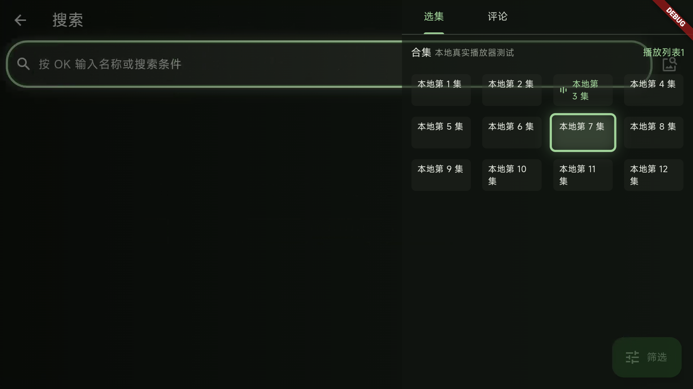

# 真实播放器本地集成检查（2026-09-06）

本轮在 `codex/tv-focus-ui01-ui04`、`c57d5d0` 基础上继续验收。仅操作
`Kazumi_Focus_UI_API36 / emulator-5562`（API 36、x86_64、1920×1080、320 dpi）。
没有操作实体电视、手机或其他 AVD；没有合并、推送或修改公开 Release。

## 结论

- 正常入口 203021：完成首次初始化；搜索框聚焦不弹键盘，OK 打开输入，BACK 先收键盘、再关闭输入并恢复焦点。
- 在线主页、规则目录及搜索均连接超时，**在线搜索和网络历史续播未通过验收**。
- 真实 VideoPage + MediaKit 的本地媒体检查发现两行选集标题溢出，已补测试并修复；原配色、透明底板和焦点边框不变。
- 修正包 203024：本地媒体出画，实际选集面板的焦点与当前集状态分离；上下、行内循环、关闭及重新打开面板可操作。
- 历史中的第 3 集、已保存的 10499 ms 能重新打开并恢复到同一记录位置；但**暂停后 seek 再退出未保存新位置**，仍是未关闭问题。
- 当前完整串行测试 **250 项通过**；这不替代在线、音画同步、真实遥控器或全机型验收。

## 测试入口和媒体边界

仅本地 `artifacts/integration-203021/local_player_entry.dart` 创建测试记录，复用正式
appModule、HistoryPage、HistoryPlaybackService、下载 / 历史仓库、VideoPage 和 MediaKit。
它不是之前只有占位播放页的 focus fixture。Hive 使用独立的
`local-player-integration-only` 目录，不修改正常入口的 `hive` 数据。

媒体由这台 AVD 的 `screenrecord` 录制本 App 测试画面生成，没有音轨；12 个测试集的
内容相同，203024 为每集使用独立文件路径。录屏、测试入口与 APK 均在忽略目录，
没有加入 `lib/main.dart` 或 `pubspec.yaml` 资源。截图背景中的搜索框 / 键盘是**视频内容**，
不是播放器又打开了输入法。

录屏存在静止画面、稀疏更新；203023 出现位置从 12 秒跳到约 38 秒，自动下一集后曾黑屏且位置停在 0。
203024 独立路径样片也有首帧等待，随后出画。未定位这些媒体时间轴 / 解码现象的根因，
因此不据此评价播放流畅性、精确 seek、自动连播或音画同步，也不宣称它们已修复。

## 选集溢出：先复现再修复

203023 实际面板的第 2 集及第 10～12 集出现底部约 4 logical px 的 RenderFlex 溢出。
原因是旧行高 52，扣除外框、内边距与行间 margin 后，两行文字不够高；
正在播放图标还会减少横向空间，使原本一行的标题换行。

- 新增 `tv_episode_tile_layout_test.dart`，按真实四列、左右 8、列距 6、底 margin 2 构造网格。
- 修复前使用旧 52 行高，403.2 宽 / 1.0 字号测试失败，日志 `tile-before.log`。
- TV 行高由两行文字及框内间距计算，默认 56，随系统文字缩放增加；手机仍使用原 70 行高与原文字样式。
- 360 / 403.2 / 440 面板宽 × 1.0 / 1.25 / 1.5 字号共 9 项，包含长标题、播放图标和下载状态图标。
- 新文件与原焦点专项共 32 项通过；全量 `flutter test --no-pub --concurrency=1` 共 250 项通过。
- 修改的两个生产文件和新测试静态分析通过；`git diff --check` 通过。

## 实际操作证据

| 操作 | 观察 | 本地截图（artifacts/integration-203021） |
| --- | --- | --- |
| 正常 203021：搜索入口 OK，BACK 两次 | 键盘仅在确认后打开，退回搜索框仍有焦点描边 | 09～12-search 系列 |
| 正常 203021：输入 evangelion 并提交 | 日志 POST 搜索 12022 ms 连接超时；页面却显示“什么都没有找到” | 13-search-submitted.png |
| 203024：历史卡 OK 进入实际播放器 | 第 3 集、本地 MP4 出画，两行文字不溢出 | 21-fixed-player.png |
| 当前第 3 集时向右到第 4 集 | 第 4 集得到焦点，当前第 3 集仍保留播放图标；不自动切集 | 22-fixed-focus4-playing3.png |
| BACK 关面板，OK 唤醒 | 控制栏出现并聚焦播放；再 OK 可暂停 | 23-fixed-ok-controls.png |
| 隐藏控制栏时 OK → RIGHT → OK | 重开选集面板，初始焦点回第 3 集 | 25-fixed-reopen.png |
| 第 3 集 DOWN → 第 7 集；UP → 第 3 集；RIGHT 两次 | 向下、向上可达；第 4 集右键循环到第 1 集，当前集仍为 3 | 26-fixed-down7.png、27-fixed-wrap1.png |
| BACK 关面板，再 BACK 退播放器 | 历史页恢复原卡片焦点，保持横屏 | 28-history-return.png |
| 历史卡再次 OK | 相同本地来源 / 第 3 集，播放器观测位置 10499 ms 与已保存记录相同 | 29-local-history-resumed.png；local-203024-evidence.log |

本图为本地录屏样片，不是在线节目证据。部分中间截图捕获到转场或控制栏超时后的不同状态，
不按文件名宣称对应路径通过；例如 24-fixed-episode-down.png 实际是顶部返回焦点，不用于选集 DOWN 验收。

## 尚未关闭的问题

1. **UI-13：暂停 seek 的进度丢失。**记录位置为第 3 集 10499 ms；暂停后方向键 seek 到
   37676 ms，再返回历史并 OK，仍恢复 10499 ms。源码中历史定时写入受 `playerPlaying` 条件限制，
   页面销毁仅取消计时器，未发现最终位置提交。下一步应覆盖暂停 seek、正常退出、切集、后台和加载失败，
   避免把尚未完成的加载位置覆盖有效历史；本轮未修改播放器存储生命周期。
2. **UI-10：连接失败被显示为空结果。**搜索日志明确连接超时，页面却显示“什么都没有找到”。
   应区分零结果和网络失败，保留可聚焦的重试。
3. **UI-12：首次启动更新渠道文案。**正常 TV fork 仍展示 F-Droid 选项及上游说明，
   可能误导用户认为该渠道提供此 fork；需要按 TV fork 的实际发布渠道整理。
4. **在线环境。**直连 Bangumi 超时；宿主机通过现有本地代理的只读 HEAD 检查成功。
   自动设置 AVD 代理的命令被执行策略拒绝，没有换路径绕过；已请求用户为专用 AVD 配置可用网络。
   网络恢复后再测在线检索、真实来源解析、历史续播出画，不改实体电视网络。

## 产物身份

| 包 | SHA-256 |
| --- | --- |
| 正常入口 203021，2.3.0-focus-race-test | e53032a7944f3c68c96a6a4b2085e3011dfb9f86192615b8546525d087fc0373 |
| 本地媒体入口 203023，中间复现包 | 336c3f3644aca5b6dc6bb735af4f1273ec3d8db7afc3acf8d5a5f058bc04b6a4 |
| 本地媒体入口 203024，修正面板验证包 | 3b38b4f5deafa995a5ce22352895ccfc7e2bbcdd0a8f66a8a52e74d1e9888b80 |
| 正常入口 203025，2.3.0-focus-integration-test，universal Release | f5e7368891d2b35bbe6dc91e4db23ecb390e734425321d07977d4011d0f2c3d8 |

203023 / 203024 / 203025 安装后的 base.apk 哈希均与本地一致。构建日志报告 Built，文件可安装；
三次构建的外层 PowerShell 调用仍返回 exit 1，不能将它描述为构建命令零退出。
验证后 AVD 留在正常入口 203025 包，保留正常数据；测试入口的本地历史没有进入正常历史库。
在 203025 再走搜索 OK → BACK 收键盘 → BACK 关闭输入，最终搜索框恢复焦点，
截图 `30-normal203025-search-restored.png`。本轮修改仍在独立工作树，未提交 / 合并 / 推送。
公开 Preview 2 / 203010、标签、APK 和发行说明不变。

后续发布说明：上述“未提交 / 合并 / 推送”为本轮集成测试结束时的状态；
相应修复随后与 TV 桌面兼容入口一起进入 [Preview 3 / 203026](TV_PREVIEW_3.md)。
新增真机证据见 [203026 安装记录](TV_DEVICE_203026.md)，不覆盖或抹去这里的失败记录。
